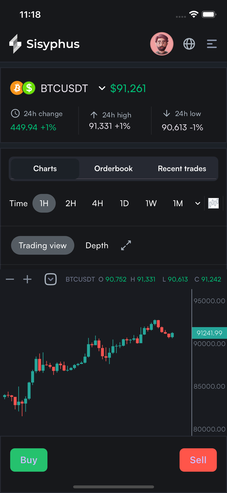
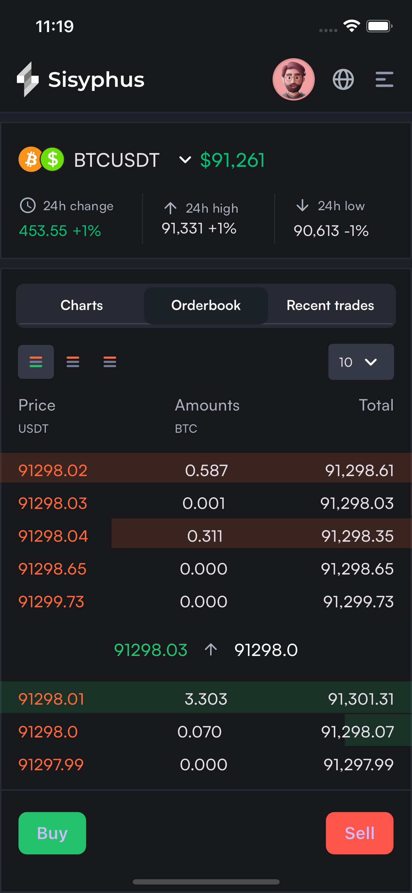
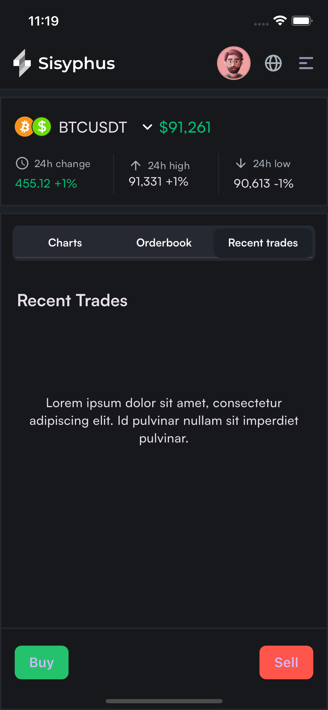
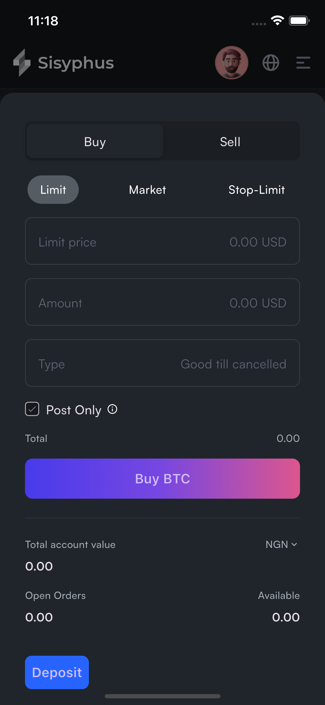
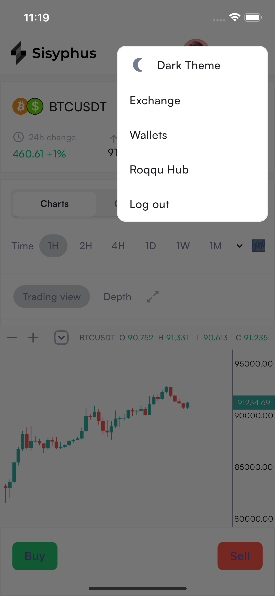

# Sisyphus

Sisyphus trading  app built with the Flutter framework and Binance Websockets API for providing real-time candlestick charting and order book updates.

## Features
- Connects to Binance WebSockets API for real-time market data.
- Displays live candlestick chart updates.
- Fetches and updates order book data in real-time.
- Uses WebSocket streaming for efficient data updates.
- Clean and responsive UI built with Flutter.

## Technologies Used
- **Flutter**: UI framework for building cross-platform applications.
- **WebSockets**: Used to establish a connection with Binance for live updates.
- **Dio**: For handling HTTP requests when fetching initial market data.
- **Hooks Riverpod**: State management for managing WebSocket streams and appstate efficiently.

## Screen recording
Here is a screen recording of the project:

[recording](https://github.com/WojuadeAA/sisyphus/blob/main/screenshots/recording.gif?raw=true)

## Screenshots
Here are some screenshots of the project:

# Binance WebSockets Flutter App

A Flutter application that consumes the Binance WebSockets API to display real-time candlestick and order book data.

